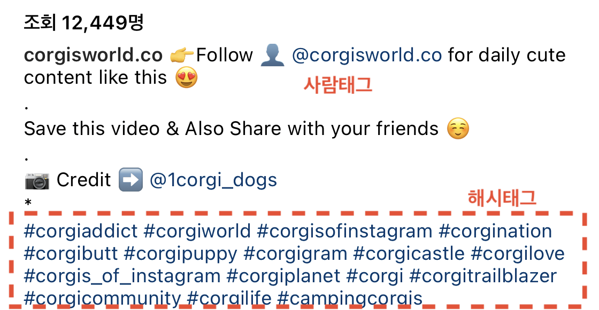
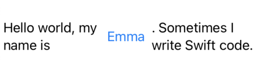
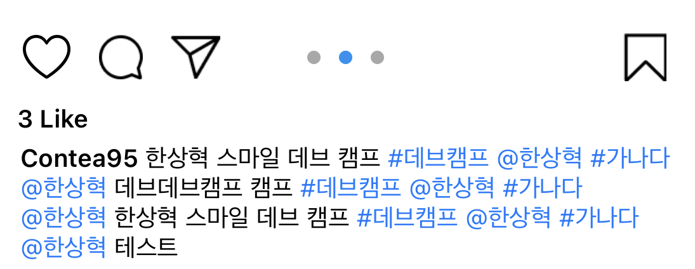
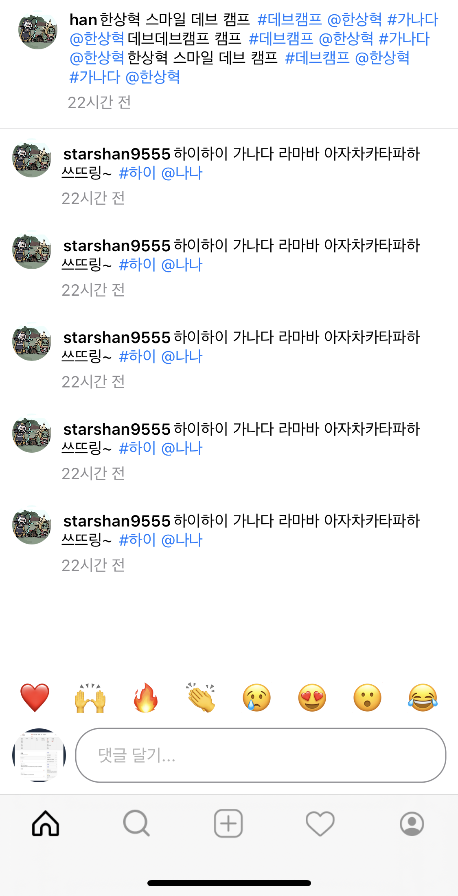
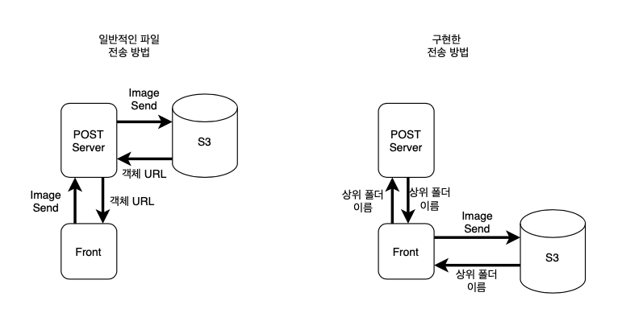

# 🙌 CODE_GUIDE

SGS DEV CAMP NCNS의 iOS 개발 담당 한상혁 인턴 입니다.

# 🤔 시작하기에 앞서..
저는 앱 구현에서 처음으로 MVC가 아닌 **MVVM 패턴**, Swift UIKit이 아닌 **SwiftUI**, 마지막으로 비동기처리인 **Combine**을 사용해서 앱을 만들게 되었습니다. 

## 🗂 MVVM 패턴 구조
이번 개발에서는 처음으로 MVVM 패턴을 사용해 데이터 구조를 담당할 **Model**, 사용자에게 보여질 **View**, 비즈니스 로직을 담당할 **ViewModel**으로 나뉘도록 하였습니다.

특히 MVVM을 사용하면서 View에서는 비즈니스 로직에 관여하지 않도록 특히나 고민을 해보았습니다. 

### 디렉토리 구조
```zsh
├── Model       # ViewModel에서 바인딩할 구조 정의
├── View        # View로 보여주기 위한 파일 정리
│   ├── Authentication
│   ├── Comments
│   ├── Feed
│   └── ...
├── ViewModel   # View에 적용될 비즈니스 로직 정의 
│   │           # (통신, 데이터 바인딩)
│   ├── Authentication
│   ├── Comments
│   ├── Feed
│   └── ...
├── Network     # 서버와 통신할 API 주소 및 ResponseModel 정의
├── Preview Content
├── Resources   # 이미지, 색상코드 정리
└── Utils       # Extension, CustomView, 상수 정의
```

## 👨‍💻 SwiftUI
MVVM 패턴을 좀 더 유용하게 쓰기 위해 SwiftUI에 도전했습니다. 또한 2019년에 출시된 최신 프레임워크라서 도전해보고 싶었습니다.

## 💻 Combine
비동기 처리 방식도 애플이 만든 퍼스트파티를 이용하고 싶었습니다. 또한 SwiftUI는 iOS 13+ 버전에서만 지원하는데, Combine도 지원 버전이 맞아서 쓰게 되었습니다. 

# 🥰 이 부분을 중점적으로 봐주세요!
## #️⃣ 피드 & 댓글 내 일반 텍스트, 해시태그, 사람태그 감별하기

인스타그램 피드는 한 줄에 태그들마다 뷰를 이동하는 이벤트를 주면서 한줄로 자연스럽게 이어진 형태로 만들어져 있습니다.

하지만 SwiftUI는 Stack구조로 뷰를 만들게되므로 스택 안에 넣게 되면
```swift
HStack {
  Text(_:)
  NavigationLink(destination:label:)
  Text(_:)
}
 ```

이와 같이 한줄로 매끄럽지 못하게 바뀌게 됩니다.

이를 해결하기 위해선 UIKit을 사용해서 구현이 가능한 방향도 있었지만, 되도록이면 **SwiftUI**를 통해서 구현하고 싶었습니다.

구현 방법은 문자열을 잘라 뷰로 만든 후 이벤트를 처리 하는 것으로 구현하였습니다.

### 🤔 제가 구현한 방법
- 한 문자열처럼 보이고, 일반텍스트, 해시태그, 인물태그 별로 각각의 이벤트를 달기 위해
    1. 피드 내용을 받아 공백으로 Split을 진행합니다. 각 결과는 배열에 저장합니다.
    2. split된 배열을 foreach문으로 하나하나 조사합니다. 조사 내용은 다음과 같습니다.
        1. **배열에 첫번째인가**? → T이면 user로 판단해서 ProfileView로 이동하는 NavigationLink
        2. **#으로 시작하는가?** → T이면 hashtag로 판단해서 hashtagView로 이동하는 NavigationLink
        3. **@으로 시작하는가?** → T이면 humantag로 판단해서 그 유저에 해당하는 ProfileView로 이동하는 NavigationLink
        4. else → 일반 텍스트로 판단해서 누르면 댓글로 이동하는 NavigationLink (인스타는 피드화면에서 내용을 누르게되면 댓글로 이동합니다. 또 댓글에서도 해시태그, 인물태그를 할 수 있으므로 비슷하게 썼지만 이 부분은 NavigationLink가 아닌 Text로 둡니다.)
    3. 이러한 과정을 통해 feedContent라는 뷰가 저장되는 배열에 하나하나 추가됩니다.
    4. 이제 View에 자른 뷰들을 ZStack을 사용해 하나하나 이어 붙였습니다. 만약 이어붙인 좌표의 width가 ZStack의 width보다 커지면 뷰를 다음 라인으로 보냅니다.
    > 댓글 부분도 이와 같지만 일반 텍스트를 누를 때 이벤트 없이 문자열만 보여주는 것만 다릅니다.

##### 참고하실 코드 링크
##### <피드 부분>
##### [FeedContentModel.swift](https://github.com/sgs-ncns/NCNS-iOS/blob/main/SGS_NCNS/SGS_NCNS/Model/Feed/FeedContentModel.swift) 👉 뷰마다 이벤트 모델 설정
##### [FeedContentFilterView.swift](https://github.com/sgs-ncns/NCNS-iOS/blob/main/SGS_NCNS/SGS_NCNS/View/Items/FeedContentFilterView.swift) 👉 피드 내용 자른 뷰의 위치, 전체 뷰의 크기 설정
##### [FeedContentViewModel.swift](https://github.com/sgs-ncns/NCNS-iOS/blob/main/SGS_NCNS/SGS_NCNS/ViewModel/Feed/FeedContentViewModel.swift) 👉 뷰마다 Prefix를 조사해 이벤트 설정
---
##### [CommentModel.swift](https://github.com/sgs-ncns/NCNS-iOS/blob/main/SGS_NCNS/SGS_NCNS/Model/Commnet/CommentModel.swift) 👉 뷰마다 모델 설정
##### [CommentFilterView.swift](https://github.com/sgs-ncns/NCNS-iOS/blob/main/SGS_NCNS/SGS_NCNS/View/Items/CommentContentFilterView.swift) 👉 댓글 내용 자른 뷰의 위치, 전체 뷰의 크기 설정
##### [CommentViewModel.swift](https://github.com/sgs-ncns/NCNS-iOS/blob/main/SGS_NCNS/SGS_NCNS/ViewModel/Comments/CommentViewModel.swift) 👉 뷰마다 Prefix를 조사해 이벤트 설정

### 구현 화면
* 피드 화면
  
  

  * 일반 텍스트를 누르면 댓글 화면으로 이동합니다.
  * 해시 태그를 누르면 해시태그 화면으로 이동합니다.
  * 인물 태그를 누르면 해당 유저의 프로필 화면으로 이동합니다.
* 댓글 화면
  
  

  * 일반 텍스트는 아무 이벤트가 없습니다.
  * 해시 태그를 누르면 해시태그 화면으로 이동합니다.
  * 인물 태그를 누르면 해당 유저의 프로필 화면으로 이동합니다.
---
## 💾 S3 접근 방식이 특이해요(with Amplify)
### S3 접근 방식
먼저 저희 팀이 설계한 방식은 사진을 올릴 때 프론트에서 S3에 올리고 서버와는 문자열로만 통신하는 방향으로 잡았습니다.

저희 팀은 피드에 사진이 무조건 들어가고, 사진에 대한 리소스에 대해서 고민을 많이 하게 되었습니다.

일반적으로는 사진을 **프론트 → POST 서버**, **POST서버 → S3**로 2번 이동하게되는데 저희는 이 2번의 과정을 줄일 수 없을까라는 의문에서부터 설계를 진행했습니다. 이 과정을 줄이기 위해서는 사진을 프론트 → S3로 1번만 보내는 과정을 떠올렸습니다.

또한 서버에게 보내는 정보 중 `사진이 저장된 Path`를 각 사진에 대한 객체 URL을 보내는 것이 아닌
```bash
# 사진 객체 URL
https://sgsncns130837-dev.s3.ap-northeast-2.amazonaws.com/public/test2/mascot_00.jpg
``` 
`사진 객체를 담은 상위 폴더 이름`을 보내서 서버와 통신하는 것들을 최대한 줄일 수 있었습니다.
```bash
# 사진이 저장된 상위 폴더 이름만 주고 받자!
test2
``` 
이미지를 불러올 때 서버와 상위 폴더 이름으로만 받기 때문에, 프론트에서는 폴더이름 내에 있는 파일 리스트를 확인해야합니다. 그래서 저희 팀 프론트는 Amplify를 사용해 리스트를 확인한 후 이미지를 다운받습니다.

### 🌊 S3 접근 흐름


##### 참고하실 코드 링크
##### <S3 접근 방식 코드>
##### [ImagePageView.swift](https://github.com/sgs-ncns/NCNS-iOS/blob/main/SGS_NCNS/SGS_NCNS/View/Items/ImagePageView.swift) 👉 Image를 보여주는 ScrollView 입니다.
##### [ImagePageViewModel.swift](https://github.com/sgs-ncns/NCNS-iOS/blob/main/SGS_NCNS/SGS_NCNS/ViewModel/Items/ImagePageViewModel.swift) 👉 사진 상위 폴더를 받으면 Amplify를 사용해 URL 객체를 배열에 저장합니다.


---
## ☺️ 이상 SGS DEV CAMP의 한상혁 인턴입니다. 
## 🙇‍♂️ 시간을 내주셔서 정말 감사합니다! 